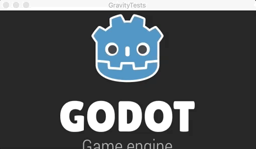

# RigidBody Planetary Physics Correct Stand Up

This demo shows how to make correct objects stand up function for planetary gravity in Godot Engine.
Requires Godot Engine 3.0 RC3 or higher version.

Feel free to contact me if you got questions about this demo.
